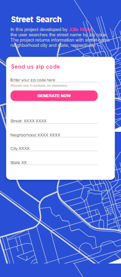
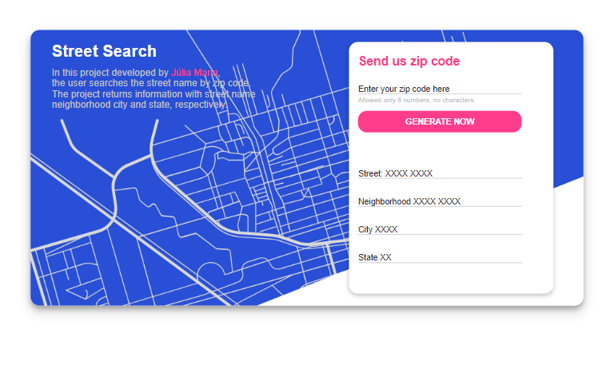
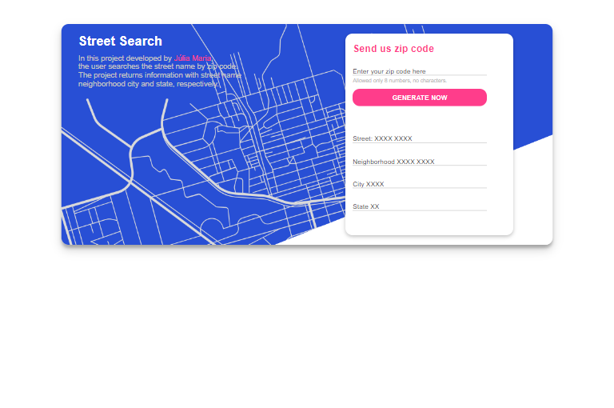

  <h1>StreetSearch - Angular</h1>
  
  

    Projeto desenvolvido com Angular que utiliza o conceito de services para consumir a API ViaCEP. O objetivo desse projeto é permitir que o usuário insira um número      de CEP e, em resposta, o programa exiba o logradouro, bairro, cidade e estado associados a esse CEP, fornecendo assim informações completas sobre a região              correspondente.
  

   
   
  
  <h2 align="center">Deploy do Site</h2>
  
  

    O site está disponível em: <a href="https://juliamariaa.github.io/StreetSearch-Angular/" target="_blank">https://juliamariaa.github.io/StreetSearch-Angular//</a>
  

   
  <h2 align="center">Screenshots</h2>
   
  <h3 align="center">Design Mobile</h3>

  

    
  

   
  <h3 align="center">Design Tablet</h3>

  

    
  

   
  <h3 align="center">Design Desktop</h3>

  

    
  

   
   
  <h2 align="center">Desenvolvido por Júlia Maria</h2>

